[English](./README.en.md) · [Website](https://n-bridge.lei6393.com) · [GitHub](https://github.com/SuperMarioYL/n-bridge)

<picture>
  <source media="(max-width: 600px) and (prefers-color-scheme: dark)" srcset="./assets/presentation/hero-mobile-dark.svg">
  <source media="(max-width: 600px)" srcset="./assets/presentation/hero-mobile-light.svg">
  <source media="(prefers-color-scheme: dark)" srcset="./assets/presentation/hero-dark.svg">
  
</picture>

# N-Bridge

**一次调用，查询所需的 Google 账户**

N-Bridge 将多个 Google 账户注册到本地 MCP 服务。可指定一个账户，也可查询所有支持相应 Gmail、Calendar 或 Drive 服务的账户。

## 为什么需要它

工作和个人数据位于不同账户时，查询既需要选对账户，也需要保留来源。N-Bridge 在调用 API 前选择符合条件的账户，并在每组返回值上保留 account_id。

- **明确查询范围** — account_id 指定一个账户；省略或使用 * 时选择全部符合条件的账户。
- **保留来源账户** — 汇总结果仍按账户和服务标记。
- **分开保存 Token 与元数据** — 刷新 Token 通过系统钥匙串后端保存，账户元数据单独存储。

## 架构

<picture>
  <source media="(max-width: 600px) and (prefers-color-scheme: dark)" srcset="./assets/presentation/architecture-mobile-dark.svg">
  <source media="(max-width: 600px)" srcset="./assets/presentation/architecture-mobile-light.svg">
  <source media="(prefers-color-scheme: dark)" srcset="./assets/presentation/architecture-dark.svg">
  
</picture>

OAuth 授权填充账户注册表和 Token 存储。stdio MCP 服务暴露 gmail.list、calendar.list、drive.list。selectAccounts 按服务和可选 ID 过滤账户，fanout 并发调用 GoogleSurfaceClient，返回带账户标记的结果。

| 组件 | 职责 |
| --- | --- |
| `MCP request` | tool + optional account_id |
| `Account selection` | registered service coverage |
| `Google client` | per-account API calls |
| `Tagged results` | account_id + surface + items |
| `OS keychain` | refresh-token storage |

## 安装与快速上手

需要 Node.js 22+。真实账户访问还需要可用的 keytar 系统钥匙串后端和 Google OAuth 客户端配置。路由示例不需要凭据或访问钥匙串。

```bash
git clone https://github.com/SuperMarioYL/n-bridge.git
cd n-bridge
npm ci
npm run build
```

随仓示例使用完整合成账户元数据调用实际 selectAccounts 函数，只展示路由决策，不模拟或宣称 Google 查询成功。

```bash
node examples/presentation-demo.mjs
```

## 实际运行示例

<picture>
  <source media="(max-width: 600px) and (prefers-color-scheme: dark)" srcset="./assets/presentation/process-mobile-dark.svg">
  <source media="(max-width: 600px)" srcset="./assets/presentation/process-mobile-light.svg">
  <source media="(prefers-color-scheme: dark)" srcset="./assets/presentation/process-dark.svg">
  
</picture>

Four routing queries show service filtering and explicit account selection; no Google data is fetched.

```text
{"surface":"gmail","account_id":"*","selected":["work","personal"]}
{"surface":"gmail","account_id":"personal","selected":["personal"]}
{"surface":"calendar","account_id":"*","selected":["work","calendar-only"]}
{"surface":"drive","account_id":"work","selected":[]}
Scope: actual account-routing function on synthetic metadata; no OAuth, keychain or Google API access.
```

完整命令与输出保存在 [docs/demo-results.json](./docs/demo-results.json). 输入和复现代码均随仓提供。


保留已有录制供参考；上方文字示例给出当前可复现的操作。

## 用法

设置 OAuth 客户端变量后，add 为一个账户打开浏览器授权，可重复添加其他账户。list 显示已注册元数据，up 通过 stdio 提供 MCP 服务。MCP 客户端应使用 node 启动 dist/index.js 的绝对路径并传入 up。工具接受 account_id、maxResults、q；q 用于 Gmail 和 Drive，不用于 Calendar。

```bash
node dist/index.js add
node dist/index.js list
node dist/index.js up
```

## 配置

NBRIDGE_GOOGLE_CLIENT_ID 和 NBRIDGE_GOOGLE_CLIENT_SECRET 提供 OAuth 凭据。NBRIDGE_CALLBACK_PORT 默认 8421；NBRIDGE_REDIRECT_URI 默认 http://127.0.0.1:<port>/cb，必须与注册回调一致。~/.nbridge/accounts.json 保存资料、服务类型和 Token 引用，keytar 在 nbridge 服务下存储刷新 Token。Token 会用于 Google 认证，查询数据返回已连接的 MCP 客户端。

## 集成与职责分工

<picture>
  <source media="(max-width: 600px) and (prefers-color-scheme: dark)" srcset="./assets/presentation/integrations-mobile-dark.svg">
  <source media="(max-width: 600px)" srcset="./assets/presentation/integrations-mobile-light.svg">
  <source media="(prefers-color-scheme: dark)" srcset="./assets/presentation/integrations-dark.svg">
  
</picture>

已实现工具使用只读权限列出 Google 数据。Gmail 返回邮件元数据和片段，Calendar 查询主日历，Drive 列出指定文件元数据。本地桥接器没有提供 Microsoft、Slack 适配器或托管团队账户池。

| 路径 | 已实现职责 |
| --- | --- |
| Gmail | message metadata listing |
| Calendar | upcoming primary-calendar events |
| Drive | file metadata listing |
| MCP stdio | three read-only list tools |
| OS keychain | refresh-token backend |

## 限制与后续方向

- 离线示例仅验证账户选择。OAuth 授权、Token 刷新、钥匙串和在线 Google API 需要单独配置与验证。
- fanout 使用 Promise.all，一个账户出错会使查询失败，不会生成部分成功报告。
- 当前列表工具不会遍历全部分页，也不提供写操作。

已实现多账户注册、系统钥匙串存储和三个 MCP 列表工具。后续方向包括部分失败报告、分页和更多服务商。托管账户池、计费、Web 面板和通知尚未实现。

## 许可与贡献

许可见 [LICENSE](./LICENSE). 反馈问题时请提供最小输入、执行命令和实际输出。
