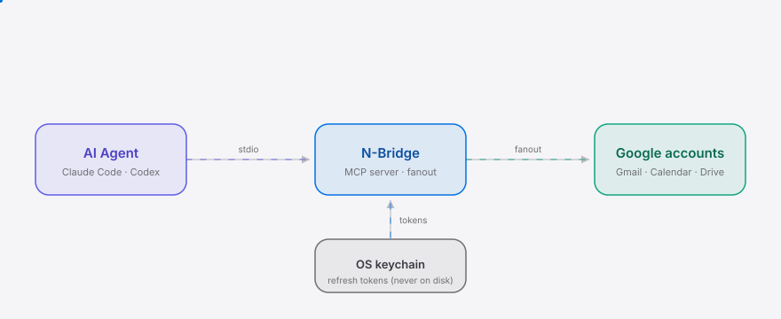

<div align="right"><sub>[English](./README.en.md) &nbsp;|&nbsp; <b>简体中文</b></sub></div>

<picture>
  <source media="(prefers-color-scheme: dark)" srcset="./assets/hero-dark.svg">
  <source media="(prefers-color-scheme: light)" srcset="./assets/hero-light.svg">
  
</picture>

<p align="center"><sub>本地多账户连接桥——让 An Ai Agent 一次触达 N 个 Gmail／日历／Drive，免反复 OAuth、免手动切号。</sub></p>

<p align="center">
  <a href="./LICENSE"></a>
  <a href="https://github.com/SuperMarioYL/n-bridge--ma7c2n4k/releases"></a>
  <a href="https://github.com/SuperMarioYL/n-bridge--ma7c2n4k/actions/workflows/ci.yml"></a>
  
  <a href="https://www.npmjs.com/package/n-bridge"></a>
  <a href="https://gitee.com/SuperMarioYL/n-bridge"></a>
  
  
</p>

> **官方连接器硬编码"一服务一账户"——多账户只能登出登入。N-Bridge 一次给你的 AI agent 挂 N 个 Google 号，刷新令牌存进系统钥匙串、永不离开本机。**

---

## 目录

- [为什么需要它](#为什么需要它)
- [架构](#架构)
- [安装](#安装)
- [快速开始](#快速开始)
- [用法](#用法)
- [Demo](#demo)
- [配置](#配置)
- [对比 googleworkspace/cli](#对比-googleworkspacecli)
- [定价](#定价)
- [路线图](#路线图)
- [常见问题](#常见问题)
- [分享](#分享)

## 为什么需要它

官方 ChatGPT/Codex 的 Gmail、Calendar 连接器把"每个服务、每个用户一个账户"写死进了计费/身份模型——你有 2+ 个 Gmail、2+ 个日历，要让 Agent 读到"另一个账户"就得手动登出登入，或跨号复制粘贴。这正是 Agent 本该消除的"人肉代理"苦役。N-Bridge 在 Agent 与 Google 之间垫一层本地桥：一次挂载 N 个账户，免反复 OAuth、免切号；它是 [NousResearch/hermes-agent](https://github.com/NousResearch/hermes-agent) 这类开放 Agent 框架节点上即插即用的多号连接器。

##  架构

三个进程内模块，一个二进制：OAuth + 令牌存储（钥匙串）→ 账户注册表 → MCP server（stdio，扇出合并）。

<picture>
  <source media="(prefers-color-scheme: dark)" srcset="./assets/atlas-dark.svg">
  <source media="(prefers-color-scheme: light)" srcset="./assets/atlas-light.svg">
   N-Bridge MCP server -fanout-> Google accounts；OS 钥匙串回灌刷新令牌">
</picture>

核心原语是**账户注册表 + 扇出工具**：每个已挂账户是 `{id, surface, profile, tokenRef}`，刷新令牌只在钥匙串里。MCP 工具 `gmail.list` / `calendar.list` / `drive.list` 接受可选 `account_id`；省略（或传 `"*"`）时**扇出**到该表面所有已挂账户，返回合并、按账户打标的结果。它把厂商的"一连接器一账户"反转为"一桥 N 账户"——正是官方按用户计费模型结构上无法复刻的那一刀。

##  安装

```bash
npm install -g n-bridge
# 或源码：git clone https://github.com/SuperMarioYL/n-bridge--ma7c2n4k && npm install && npm run build
```

需要 Node ≥ 22（keytar 原生绑定在 macOS Keychain / Windows 凭据管理器 / Linux Secret Service 上各取预编译包）。

##  快速开始

3 条命令，从冷克隆到读两个收件箱：

```bash
export NBRIDGE_GOOGLE_CLIENT_ID=xxxx.apps.googleusercontent.com  # 一次性，见 BUILD_SETUP_NEXT_STEPS
export NBRIDGE_GOOGLE_CLIENT_SECRET=xxxx
nbridge add        # 浏览器 OAuth → 刷新令牌进钥匙串
nbridge add        # 挂第 2 个账户
nbridge up         # 启动桥 + MCP server（stdio）
```

<details><summary>示例输出</summary>

```
$ nbridge list
2 account(s) mounted:
  acct-1  Founder <founder@workmail.com>  [gmail, calendar, drive]
  acct-2  <ops@sidehive.io>  [gmail, calendar, drive]

$ nbridge up
nbridge up — 2 account(s) mounted. MCP server starting on stdio…
```
</details>

##  用法

最常见的 5 个工作流（完整示例见 [`examples/`](./examples)）：

```bash
nbridge add          # 挂载一个 Google 账户（浏览器 OAuth，令牌进钥匙串）
nbridge list         # 查看已挂账户（只读元数据，令牌不出钥匙串）
nbridge up           # 启动桥 + MCP server（stdio），交给 Agent 连
nbridge --version
nbridge --help
```

把 `nbridge up` 接到 Agent（Claude Code / Codex / 开放框架节点）：

```json
{ "mcpServers": { "nbridge": { "command": "nbridge", "args": ["up"] } } }
```

对 Agent 说"列出我所有账户里的未读邮件"——一次 `gmail.list` 调用就扇出并合并所有已挂收件箱的结果。要只查某号，传 `account_id`（从 `nbridge list` 拿）：

```json
{ "account_id": "acct-1", "maxResults": 5 }
```

##  Demo

`nbridge add` ×2 → `nbridge up` → Agent 一次 `gmail.list` 读两个收件箱：


> 录制脚本见 [`docs/demo.tape`](./docs/demo.tape)，由 `.github/workflows/demo.yml` 用 vhs 渲染。

##  配置

全部走环境变量（无配置文件，无明文落盘）：

| 变量 | 类型 | 默认 | 含义 |
|---|---|---|---|
| `NBRIDGE_GOOGLE_CLIENT_ID` | string | — | Google OAuth 客户端 ID（必填，见 BUILD_SETUP_NEXT_STEPS） |
| `NBRIDGE_GOOGLE_CLIENT_SECRET` | string | — | Google OAuth 客户端密钥（必填） |
| `NBRIDGE_CALLBACK_PORT` | number | `8421` | OAuth 回调本地端口 |
| `NBRIDGE_REDIRECT_URI` | string | `http://127.0.0.1:8421/cb` | OAuth 回调地址（须与 Google 控制台一致） |

账户元数据存于 `~/.nbridge/accounts.json`（仅 email + tokenRef，**无令牌**）；刷新令牌只在系统钥匙串，键为 `nbridge` 服务。

## 对比 googleworkspace/cli

| 维度 | [googleworkspace/cli](https://github.com/googleworkspace/cli) | N-Bridge |
|---|:---:|:---:|
| 统一 Gmail／Calendar／Drive 给 Agent | ✓ | ✓ |
| 多账户（N 个 Google 号一桥挂载） | — | ✓ |
| 一次 OAuth 持久化、免反复授权 | — | ✓ |
| 刷新令牌进 OS 钥匙串、不离本机 | — | ✓ |
| Google 官方背书、社区规模 | ✓（30k★） | — |

诚实说：googleworkspace/cli 在表面覆盖广度与生态规模上远胜 N-Bridge——它把 Drive/Sheets/Docs 都收进一个工具。N-Bridge 只补它没补的那一刀：**多账户 + 持久令牌**。它不是替代品，是互补层。

##  定价

| 层 | 价格 | 说明 |
|---|---|---|
| **本地 OSS** | 永久免费 | 就是这个仓库。单操作者本地桥，令牌永不离开本机 |
| **托管团队版**（规划中） | ¥99 / 席位 / 月（3 席起） | 托管多账户桥 + 企业号池（共享刷新令牌池、轮换、审计日志）+ 国产编码 Agent（豆包 / Trae / Kimi）连接器包 |

托管形态：[Fly.io](https://fly.io)（全球）+ 阿里云（国内延迟）；计费走 Stripe（全球）+ 微信支付（国内）；刷新令牌静态加密、按团队 KMS 隔离。**本地 OSS 永久免费是漏斗，托管团队版是商业化收盘。**

> v0.1 只交付本地 OSS 层。托管团队版是路线图项，未在当前版本实现。

##  路线图

- [x] **m1 — 挂账户 OAuth**：`nbridge add` 走浏览器同意，刷新令牌存进钥匙串
- [x] **m2 — 扇出 MCP server**：`gmail.list` / `calendar.list` / `drive.list` 跨账户扇出、合并打标
- [x] **m3 — 一命令起 + Demo**：`nbridge up` 一命令启动注册表 + MCP server
- [ ] 托管团队版（企业号池 + 审计 + 国产编码 Agent 连接器包）
- [ ] 非 Google 表面（Microsoft / Slack 等，v0.1 明确不做）
- [ ] Web 仪表盘（v0.1 仅 CLI + MCP）
- [ ] 推送通知 / webhook（v0.1 仅轮询扇出）

##  常见问题

**为什么官方 ChatGPT/Codex 连接器不能多账户？**
不是功能缺口，是模型冲突。厂商的按用户计费/身份模型把"一份订阅 = 一个身份"写死，挂 N 个账户会扯断其计费脊柱——这正是其插件团队在公开征集多账户需求的原因。N-Bridge 从外部绕开这道墙。

**我的刷新令牌存在哪里？是否离开本机？**
系统钥匙串：macOS Keychain / Windows 凭据管理器 / Linux Secret Service。永不明文落盘，永不上传。`~/.nbridge/accounts.json` 只存 email + tokenRef，不含令牌。

**OpenAI 原生上线多账户后 N-Bridge 怎么办？**
这是单一最大风险。缓解策略：卡位开源框架节点（NousResearch/hermes-agent 这类）——厂商无法触及开源框架。若官方 90 天内宣布，立即转向"开源框架标准节点"路线；本地 OSS 层永久免费，不依赖官方路线存活。

##  分享

```
N-Bridge — 一次给 An Ai Agent 挂 N 个 Google 号的本地连接桥。一条 `nbridge up`，Claude Code 跨两个 Gmail 收件箱一次读完。令牌留在系统钥匙串、不离本机。https://github.com/SuperMarioYL/n-bridge--ma7c2n4k
```

## License

[MIT](./LICENSE) · 独立维护者持有。提 Issue / PR 欢迎：[issues](https://github.com/SuperMarioYL/n-bridge--ma7c2n4k/issues)。

<p align="center"><sub><a href="./LICENSE">MIT</a> © 2026 SuperMarioYL</sub></p>
